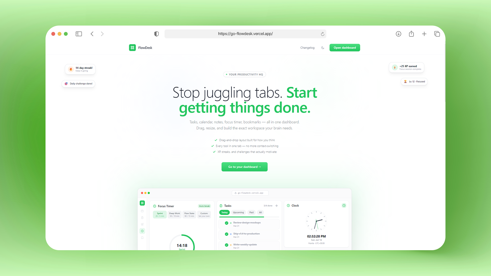

<div align="center">
  
  <h1>FlowDesk</h1>
  <p>A customizable productivity dashboard that consolidates your tools — tasks, calendar, notes, focus timer, music, and more — into one drag-and-drop workspace.</p>

  <p>
    <a href="https://go-flowdesk.vercel.app/" target="_blank"></a>
    
    
    
    
    
    
  </p>
</div>

---



---

## Features

**Nine widgets, one workspace.** Every widget is independently draggable, resizable, and persistable across sessions and devices.

| Widget | What it does |
|---|---|
| **Calendar** | Mini month view + fullscreen event manager with color-coded tags |
| **Tasks** | Drag-to-reorder tasks, filters, color labels, tag support |
| **Notes** | Auto-saving editor with Picture-in-Picture pop-out on desktop |
| **Focus Timer** | Pomodoro-style with 4 modes, fullscreen, floating pop-out, and keyboard shortcuts |
| **Music** | YouTube + Spotify embeds, saved playlists, floating mini-player |
| **Clock** | Analog / digital toggle, multi-timezone display |
| **Streak Tracker** | Daily usage streaks, personal best, 7-day heatmap, milestone badges |
| **Milestones** | Long-term goal tracking with target dates and progress bars |
| **Bookmarks** | Link manager with favicons, annotations, favorites, and date grouping |

**Gamification engine** — earn XP for completing tasks and focus sessions, level up through titled ranks (Newcomer → Flow Master → Legend), and compete on a global leaderboard.

**Customization** — drag, resize, and reorder widgets freely. Save named layout presets and switch between them (e.g. "Deep Work" vs. "Planning").

**PWA** — installable on desktop and mobile. Offline-resilient with a Workbox service worker.

**Dark mode** — explicit toggle with `localStorage` persistence.

**Demo mode** — visitors can try the app without an account; a subset of widgets are freely interactive.

---

## Tech Stack

| Category | Technology |
|---|---|
| Framework | React 18 + React Router 6 |
| Build | Vite 5 + VitePWA (Workbox) |
| State | Zustand (9 domain stores) |
| Backend | Supabase (PostgreSQL, Auth, RPC) |
| Styling | TailwindCSS 3 (custom green accent palette) |
| Animation | Framer Motion 12 |
| Grid | react-grid-layout (4 responsive breakpoints) |
| Encryption | Web Crypto API — AES-GCM for notes |

---

## Project Structure

```
src/
├── App.jsx                   # Router root, dark mode sync, lazy route splits
├── components/               # Shared UI (modals, landing page, gamification, admin)
│   └── gamification/         # XP toasts, daily challenges, weekly recap, leaderboard
├── features/                 # Widget modules (self-contained)
│   ├── bookmarks/
│   ├── calendar/
│   ├── clock/
│   ├── focus/
│   ├── milestones/
│   ├── music/
│   ├── notes/
│   ├── streak/
│   └── tasks/
├── layout/                   # App shell — Sidebar, MobileNav, AppLayout, ProtectedRoute
├── store/                    # Zustand stores (one per domain)
├── services/                 # Supabase API calls (one file per domain)
├── hooks/                    # useMediaQuery, usePWAInstall
├── lib/                      # notesCrypto.js (AES-GCM note encryption)
└── data/                     # changelog.js (static release history)
```

---

## Architecture Notes

- **Grid**: `react-grid-layout` with 4 breakpoints (`lg/md/sm/xs`). Layouts saved to Supabase with 800ms debounce.
- **State**: 9 Zustand stores, each scoped to a domain. All expose `reset()` called on sign-out to prevent cross-user leaks.
- **Optimistic UI**: Tasks, widget visibility, and layout changes update the store instantly; Supabase confirms asynchronously.
- **Encryption**: Notes are AES-GCM encrypted client-side before storage — the server never sees plaintext.
- **XP security**: All XP awards go through a Supabase RPC function — clients cannot self-award.

---

## License

MIT
